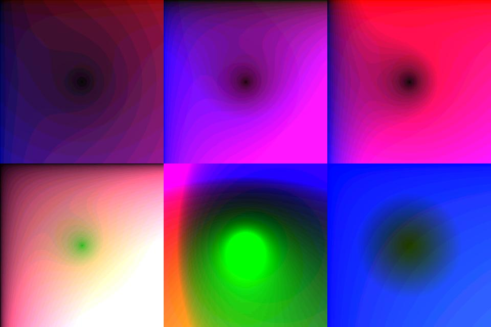

## Color Effects \- Nice Images

### Description

Creates some really nice graphics using VB.

It's not hard at all, but it's not very usefull either. Just gives a hint of what you could make. The screenshot does not do it any credit!

(left click the form to exit it!)
 
### More Info
 
Basic VB. That's all!

Some images :-)

Getting dizzy, at worst.

             |
---                |---
**Submitted On**   |2002-06-17 14:28:36
**By**             |[Wouter Lievens](https://github.com/Planet-Source-Code/PSCIndex/blob/master/ByAuthor/wouter-lievens.md)
**Level**          |Beginner
**User Rating**    |5.0 (10 globes from 2 users)
**Compatibility**  |VB 6\.0
**Category**       |[Graphics](https://github.com/Planet-Source-Code/PSCIndex/blob/master/ByCategory/graphics__1-46.md)
**World**          |[Visual Basic](https://github.com/Planet-Source-Code/PSCIndex/blob/master/ByWorld/visual-basic.md)
**Archive File**   |[Color\_Effe953856172002\.zip](https://github.com/Planet-Source-Code/wouter-lievens-color-effects-nice-images__1-35946/archive/master.zip)

